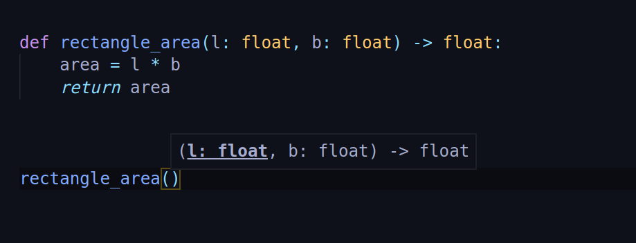

# Best Python Tricks 🤩

## Index

- [type() function](<#type()-function>)
- [... or Ellipsis](#...-or-ellipsis)
- [Document Your Functions](#document-your-functions)
- [Developer note](#developer-note)

---

## `type()` function

you must have used Python's type method to get the `type of any object`.
But, this one is much better.

```python
>>> # with integer
>>> x = 10
>>> type(x)()
0
>>>

>>> # with string
>>> name = "Rajesh"
>>> type(name)()
''
>>>

>>> # with boolean
>>> value = True
>>> type(value)()
False
>>>
```

**HOW?**

We all know, passing an object to `type()` returns class of that object.

```python
>>> type(10)
<class 'int'>
>>>
```

And, calling any `class name` returns the same

```python
>>> int
<class 'int'>
>>>
```

We also know, we can instantiate object of any class like this

```python
>>> int()
0
>>>
```

It, returns default value of that object. This is what hapenning in our case also, `type(10)()` is returning default value of class int(10 in int).

**USE CASE?**

let's say we want to return different things for different inputs. We can use this trick.

```python
def what_type(inp):

    if type(inp)() == 0:
        return "NUMBER"

    elif type(inp)() == '':
        return "STRING"

    elif type(inp)() == False:
        return "BOOLEAN"

    elif type(inp)() == 0.0:
        return "INTEGER"

    ...

    return "UNKNOWN TYPE"
```

---

## ... or Ellipsis

Want your code to be more redible? try this -

```python
>>> ...
Ellipsis
>>>
```

An alternative to `pass` ?

```python
def func1():
    pass

def func2():
    ...

same = func1() == func2()
print(same)
```

```bat
rajeshj3@dev:~$ python3 main.py
True
rajeshj3@dev:~$
```

So no doubt, It's an alternative to `pass` keyword.

**USE CASE?**

Make abstract methods `prettier`

```python
>>> def my_func(): ...
...
>>> my_func()
>>>
```

---

## Document Your Functions

To make your functions more understandable use extended docs.

```python
def rectangle_area(l: float, b: float) -> float:
    area = l * b
    return area
```

With default parameter

```python
def square_area(s: float = 10) -> float:
    area = s ** 2
    return area
```

---

**RESULTS**, In Vs Code



## Developer note

Hey coders, more and more python tricks will be added to this doc. 🤩

_NOTE:_ Don't forget to **Bookmark** this page 🔖

---

Thank you

cheers!

[RajeshJ3](https://github.com/RajeshJ3)
